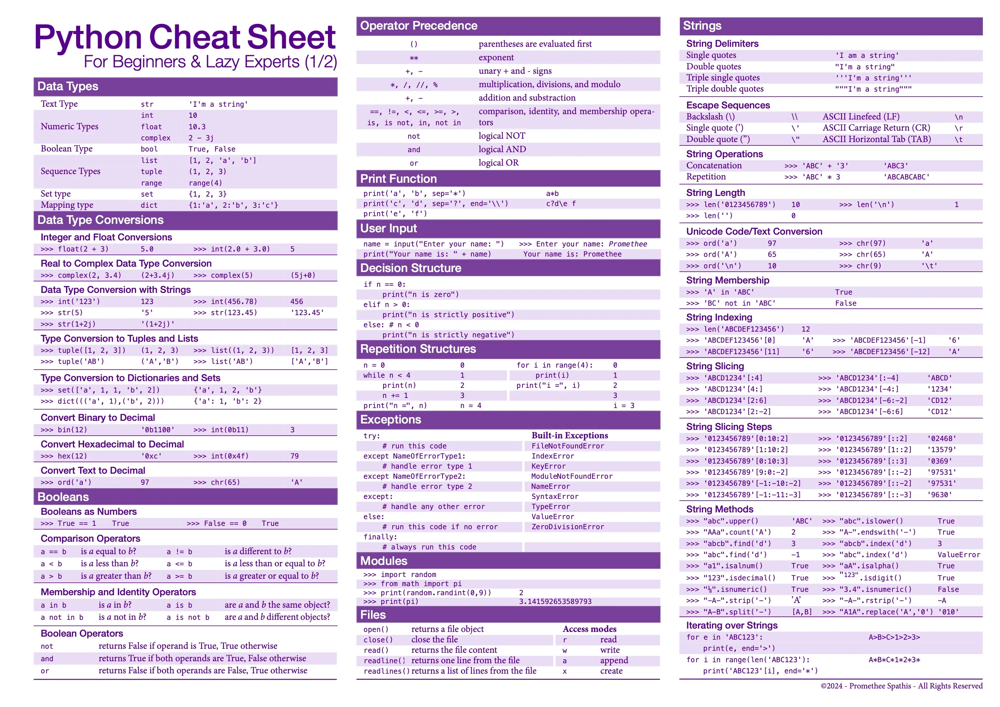

# PythonKnowledge
## A bunch of stuff I know in Python, cheatsheets and projects (I mostly have cheatsheets for now though)
### Everything will be organized in subjects and sub-subjects, every subjects should have their own readme as well, if I remember they should have at least.

#### [AI & Data Processing](https://github.com/DeusExAliquo/Knowledge/tree/main/PythonKnowledge/AIDataProcessing)

#### [Database](https://github.com/DeusExAliquo/Knowledge/tree/main/PythonKnowledge/Database)

#### [WebScrapping (empty for now)](https://github.com/DeusExAliquo/Knowledge/tree/main/PythonKnowledge/WebScrapping)

## Python cheatsheets I use if needed :

[Long CheatSheet](./PythonCheatSheetLong.pdf)

Short CheatSheets :

